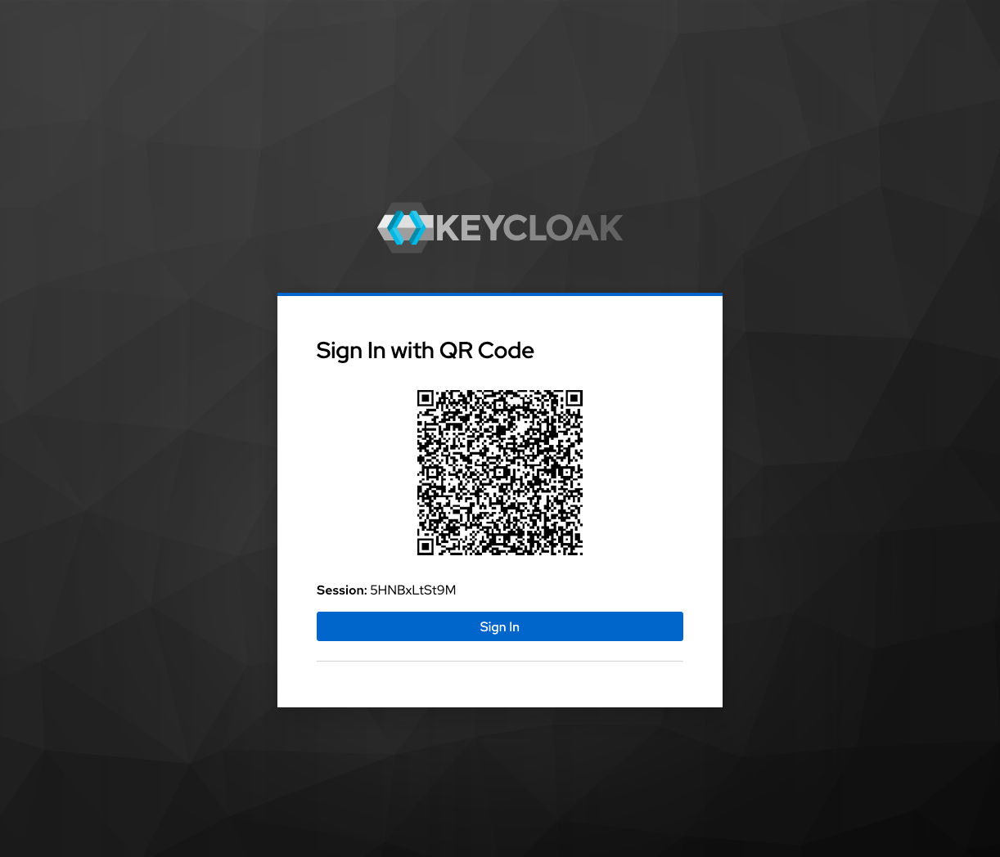
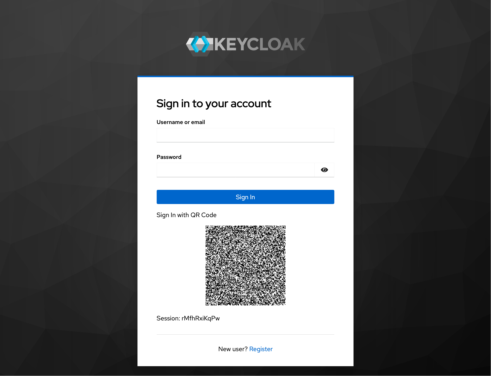

# Keycloak QR Code Authentication 

 

Sign in to Keycloak with another device using QR Codes.

This authentication extension for [Keycloak](https://www.keycloak.org/) provides an authentication execution enabling users to complete authentication with another device.

With QR code authentication, users can quickly and securely authenticate without typing passwords or sharing passwords on untrusted devices. It also enables usage of Passkeys on devices without Bluetooth by completing authentication with a passkey on a passkey enabled device..

## Features

There are two executions available: **QR Code Sign In** and **Username Password Form with optional QR Code login**

Both executions provide:

- Authentication executions available in browser bound flows
- Confirmation of session id (tabID) on confirmation page
- Confirmation of User Agent and originating device information on the confirmation page

The **QR Code Sign In** execution:

- Sign in page refreshes automatically to check if another device has completed authentication
- Does not require new ftl templates when custom themes are used

    

The **Username Password Form with optional QR Code login** execution:

- Builds on keycloak.v2 `login.ftl` template
- Requires a custom `qr-login.ftl` template if the realm uses a custom theme (see [Template Themes](#Template-Themes))
- Sign in page provides default username password field and optional QR code.

    

## Compatibility
Compatible with **Keycloak 26.4.x**. Should be compatible with 26.3.x but has not been tested.

## Installation

1. Download the latest compatible release from the [releases page](https://github.com/HadleySo/keycloak-extension-qr-code-execution/releases)
2. Save the downloaded JAR file into the `providers/` directory inside Keycloak installation folder
3. Stop the Keycloak server
4. Rebuild the installation using `kc.sh build` command
5. Start Keycloak

## Configuration

**No configuration** needed if *Username Password Form with optional QR Code login* is not used. *QR Code Sign In* can just be added to your browser flow. 

Optional configuration is available for **Refresh Rate** and **Login Timeout**:  
- Refresh rate sets how often the login page reloads to check if a user has authenticated  
- Login timeout sets how long the user has before the flow is invalidated  
- **Note**: If the Refresh Rate is zero or less than Login Timeout, the QR code will display even when the flow has expired/invalidated.

#### Template Themes
The [ftl templates](src/main/resources/theme-resources/templates) can be overridden. This is optional, unless the *Username Password Form with optional QR Code login* execution is used in a realm with a custom theme.

`qr-login.ftl` - for *Username Password Form with optional QR Code login*
- Based on login.ftl from keycloak.v2 theme
- Requires macro import `<#import "qrLogin.ftl" as qrlogin>`
- To render QR code `<@qrlogin.qrLogin />`

`qr-login-scan.ftl` - for *QR Code Sign In* when QR code is displayed
- requires `${url.resourcesPath}/js/qrcode.min.js` and `${url.resourcesPath}/js/jquery.min.js` for javascript
- requires `QRauthToken` to provide the QR Code URL

`qr-login-verify.ftl`- for *QR Code Sign In* after the user authenticates, prompts to reject or approve
- requires `${approveURL}` to approve the sign in and `${rejectURL}` to reject.
- optional originating device info: `${ua_device}`, `${ua_os}`, `${ua_agent}`, and `${local_localized}`

#### Messages

Only English and German is provided, see [messages_en.properties](src/main/resources/theme-resources/messages/messages_en.properties) and [messages_de.properties](src/main/resources/theme-resources/messages/messages_de.properties).

## JWT Information

The JWT encoded in the token is signed but not encrypted. It exposes the following to all users, even when unauthenticated:

- Realm URL
- Realm Name
- Realm ID
- Keycloak public FQDN
- Originating device user agent OS
- Originating device user agent device
- Originating device user agent agent name
- Originating device locale (Accept-Language header)
- Originating device locale language name, country name, and variant, localized
- Keycloak session ID
- Keycloak tab ID
- Issuance time / authentication start time
- Type (static, the unique ID of this authentication provider)
<!-- - Originating device IANA time zone name (eg Atlantic/Reykjavik) -->

## License  

Keycloak QR Code Authentication (keycloak-extension-qr-code-execution / com.hadleyso.keycloak.qrauth) is distributed under [GNU Affero General Public License v3.0](https://www.gnu.org/licenses/agpl-3.0.txt). Copyright (c) 2025 Hadley So.

[`qrcode.min.js`](https://github.com/davidshimjs/qrcodejs) is distributed under [MIT License](https://mit-license.org/) Copyright (c) 2012 davidshimjs
